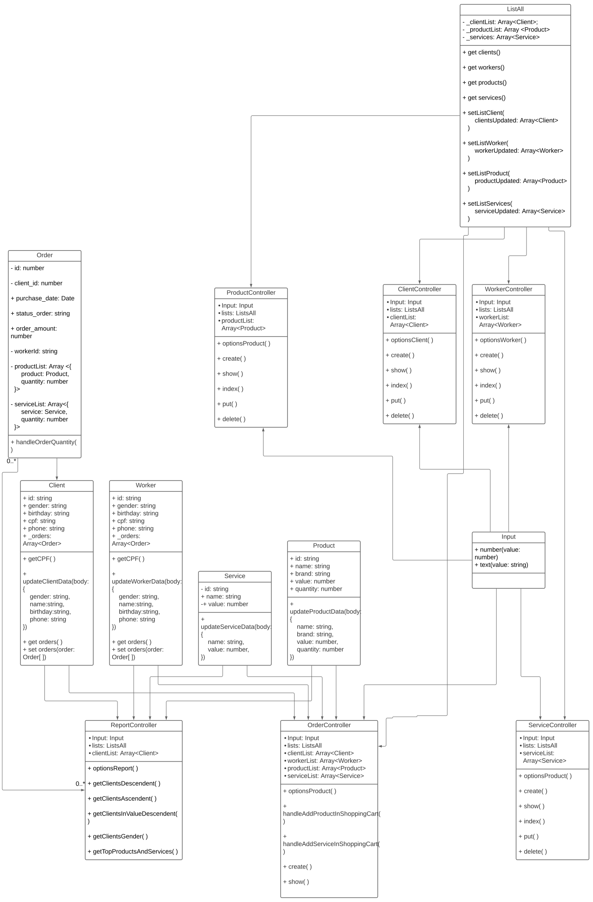

<div align="center">

## :lipstick: :nail_care: World Beauty

| Nome: | Gabriel Camargo Leite | RA: | 1461392111029 |
|:------:|:----------:|:-------------|:-------------:|

Projeto para gerenciamento de serviços de salão de beleza proposto pela FATEC (Técnicas de Programação I) <br>
Professor: Gerson

</div>

---


### Pré-requisitos

Para startar o projeto, é necessário ter o TypeScript e o Node.js instalados em sua máquina via `npm` ou `yarn`.

### Links úteis (para antes de clonar o repositório)
- [Instalação das ferramentas](https://www.notion.so/Instala-o-das-ferramentas-405f3e8b014649cbb422dee6b5bd0535): como instalar o Node, NPM ou Yarn e o Visual Studio Code (tutoriais para Windows, MacOS e Linux)
- [Atualização (caso já tenha as ferramentas](https://www.notion.so/Atualiza-o-vers-es-diferentes-09abff4d88d44c459a7c7a925ad15bfa): se já passou pelo processo de instalação do Node, NPM e Yarn alguma vez, realize este tutorial para garantir as versões mais recentes das ferramentas (para Windows, MacOS e Linux)
- [Caso surja algum problema...](https://www.notion.so/Tive-problemas-e-agora-c67378e1319d4723a3211aad8eb987c6)

Instalando o typescript com npm:
```
$ npm install -g typescript
```

Caso prefira instalar o typescript com o yarn:
```
$ yarn add typescript
```

### Passo 1 - Clonando o projeto

Clonar o projeto utilizando o comando do git em seu terminal e diretório onde queira salvar o projeto:

```
$ git clone https://github.com/GabrielCamargoL/World-Beauty-Fatec.git
```

#### Passo 1.1 - Instalando as dependências

Antes de executar o projeto, instale as dependencias via `npm` ou `yarn`. 

Instalando com npm:
```
npm install
```

> Caso utilizar a versão 7 do npm pode ocorrer erro de versão das dependências, neste caso utilize `npm install --legacy-peer-deps`.

Caso prefira instalar com o yarn:
```
yarn install
```

### Passo 2 - Compilando o projeto

para o compilar o projeto e convertemos o código typescript(TS) para javascript(JS) usaremos o compilador "tsc", para isso, execute em seu terminal:

```
$ tsc
```

> Ao executar o comando acima, será criado uma pasta chamada "out" contendo o código javascript e pronto para ser utilizado com o node.js.

### Passo 3 - Rode o seu projeto

Agora basta executar mais um comando para executar o projeto e utilizá-lo :)

```
$ node out/main.js
```

## Explicação da estrutura das pastas

| Pasta                                        | Definição                                                                                            |
| -------------------------------------------- | ---------------------------------------------------------------------------------------------------- |
| :open_file_folder: node_modules/             | Armazena as bibliotecas (dependências) usadas pelo projeto                                           |
| :open_file_folder: src/ controllers          | Arquivos com os métodos para manipulação de dados sobre CRUD e auxiliares                            |
| :open_file_folder: src/ models               | Arquivos considerados moldes/classes da aplicação                                                    |
| :open_file_folder: src/ utils                | Arquivos considerados de utilidade extra, como registro de amostras de dados, Inputs e listagens     |
| :open_file_folder: src                       | Pasta contendo todo o código fonte do projeto                                                        |
| :page_facing_up: tsconfig.json               | Arquivo de configuração do Typescript para indicar diretorios finais, versao JS para transpile etc   |
| :page_facing_up: package.json                | Arquivo usado para gerenciar as dependências do projeto, scripts e versões                           |

<br> <br>
### Diagrama de Classe:


